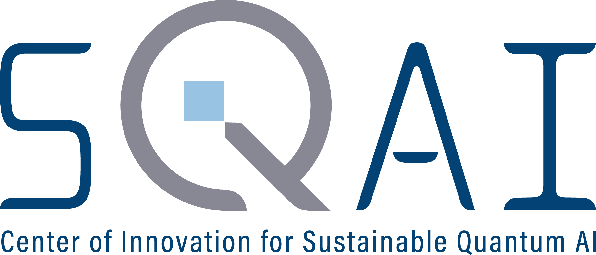

# Qailo.jl

Supersimple quantum circuit simulator Qailo.jl,
inspired by [qailo in Python](https://github.com/wistaria/qailo).

## Expectation

* Julia 1.9-

## Installation

```
]add https://github.com/MGYamada/Qailo.jl
```

## Circuit notation

```julia
using Qailo
circ"X(1) Y(2) CZ(1,2)"
```

A circuit is just represented by `Tuple` of `Gate`.

Circuits with other number types are supported by an additional flag letter.

| flag | precision |
| ---- | ---- |
| h | half (`Float16`) |
| s | single (`Float32`) |
| d | double (`Float64`) |

```julia
circ"X(1) H(2) CX(1,2)"s
```

This may be suitable for a GPU simulation.

If you would like to use Unicode, there is a nice representation. This is only supported for systems up to 9 qubits.

```julia
circ"X₁ H₂ CX₁₂"
```

Note that `Circuit` will be read from left to right.

## Braket notation

```julia
psi = @zero 2
braket"<psi|CX(1,2)|psi>"
```

It looks much better when you use Unicode.

```julia
ψ = @zero 2
braket"<ψ|CX₁₂|ψ>"
```

Note that brakets will be read from right to left.

## Measurement

```julia
ψ = @one 2
p = prob(apply(ψ, circ"CX₁₂"))
```

This will return the measurement probability in the `Vector` form.
If you need something more intuitive, you can use the following function.

```julia
prob2dict(p; pad = 2)
```

In this case, the bit index should be read from right to left. You can easily reverse it.

```julia
prob2dict(p; pad = 2, rev = true)
```

Here you can read the index from left to right.

## License

MIT

This work has been supported by .